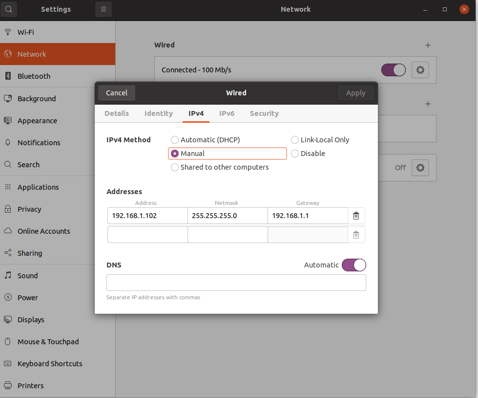

### Set the static IP of the radar wired network, note that it is IPv4




# fiirst compile leishen c16 driver

```

cd lslida_C16

catkin_make
source ./devel/setup.sh
bash run_leishen.sh 
```


# second  compile lego_loam


```

cd ../lego_loam_c16/

catkin_make
source ./devel/setup.sh
bash run_lego.sh
```

### Check all the options on the left side.


